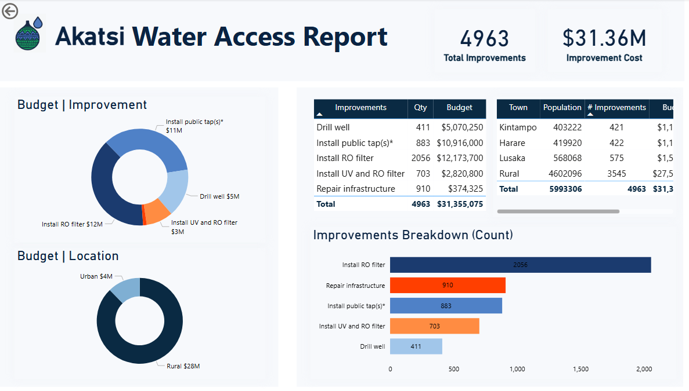

# **Maji Ndogo – Water Access Dashboard (Power BI Project)**

This repository contains a Power BI dashboard analyzing water access conditions across the fictional country **Maji Ndogo**.  
The project focuses on **data storytelling**, **DAX modeling**, **GeoJSON mapping**, and translating survey data into clear insights.

---

## **📌 Project Overview**

This dashboard answers key questions:

- **How many people have basic access to clean water?**
- **Which provinces require the highest number of upgrades?**
- **What is the estimated improvement budget (~$146M)?**
- **How do rural vs. urban populations differ in water access?**
- **What are the most common water sources across locations?**

---

## **📊 Key Insights**

### **1️⃣ Basic Water Access**
- Only **34%** of the population has basic access.
- That means **66%** (≈18 million people) still face water challenges.

---

### **2️⃣ Budget Requirements**
- Total improvement budget needed: **$146M+**
- Highest needs:
  - **Sokoto → ~$40M**
  - **Kilimani → ~$39M**
- Lowest:
  - **Amanzi → ~$13M**

---

### **3️⃣ Required Upgrades**
- **Kilimani → 6700 upgrades**
- **Sokoto → 5603 upgrades**
- **Amanzi → 3748 upgrades** (lowest)

---

### **4️⃣ Rural vs Urban**
- **Rural areas:** rely heavily on shared taps and wells.
- **Urban areas:** more use of in-home taps.

---

### **5️⃣ Province Comparison**
- **Lowest access:** Kilimani (28%)
- **Highest access:** Amanzi (41%)
- **National average:** 34%

---

## **💡 Recommendations**

1. **Prioritize investment** in high-need provinces (Kilimani & Sokoto).
2. **Improve rural infrastructure** — shared taps, wells, monitoring systems.
3. **Repair critical infrastructure** — broken taps, RO filters, contaminated wells.

---

## **🛠 Tools & Skills Used**

- **Power BI Desktop**
- **DAX:**
- **GeoJSON Map Integration**
- **Data Storytelling & Visualization Design**

---

## **📂 Repository Structure**

## 🔎 Akatsi Region – Detailed Analysis

As part of the Maji Ndogo water access project, this section provides a focused drill-down analysis for **Akatsi**.  
The goal of this page is to understand how the improvement budget is distributed within the region, the number of required upgrades, and how rural vs. urban areas differ in water access needs.

### 📊 Key Findings for Akatsi
- **Total Improvements:** 4963 upgrades  
- **Total Budget:** **$31.36M** allocated to the region  
- **Highest-cost improvement:** Installing RO filters ($12M)  
- **Most frequent improvement:**  
  - Install RO filter → **2056 upgrades**  
  - Repair infrastructure → **910 upgrades**
- **Budget by Location:**  
  - Rural areas receive **$28M**  
  - Urban areas receive **$4M**
- **Rural areas show the highest need**, especially for drilling wells and installing RO filters.

### 🗂️ What this Dashboard Shows
- Budget distribution by improvement type (donut chart)  
- Budget distribution by rural vs. urban areas  
- Table summarizing improvements, quantities, and budget  
- Town-level population vs improvement needs  
- Horizontal bar chart showing the count of improvements per type

### 🎯 Insight Summary
Akatsi requires significant investment in **RO filters, public taps, and repair work** to improve water quality and access.  
Most of the demand comes from **rural communities**, which aligns with the overall trend in Maji Ndogo.

### 📸 Dashboard Preview (Akatsi Drill-Down)

